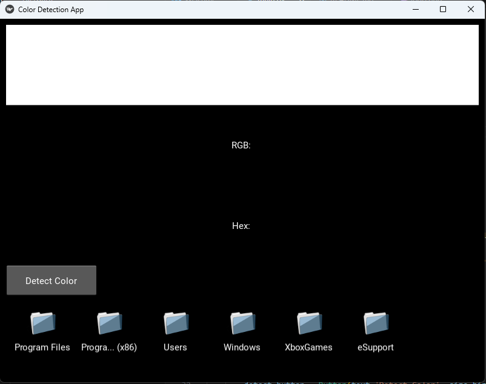

# KayNN

This is a simple Python application built using Kivy that allows users to select an image file and determine its dominant color using the K-Means clustering algorithm.

## Features

- Select an image file (PNG, JPG, JPEG, GIF) using a file chooser.
- Preview the selected image.
- Detect the dominant color in the image using K-Means clustering.
- Display the RGB and hex values of the dominant color.
- Display a preview of the dominant color.

## Installation

1. Clone this repository:

    ```bash
    git clone https://github.com/example/KayNN.git
    ```

2. Install the required dependencies:

    ```bash
    pip install kivy opencv-python-headless skikit-learn
    ```

## Usage

1. Navigate to the directory where you cloned the repository:

    ```bash
    cd KayNN-main
    ```

2. Run the application:

    ```bash
    python main.py
    ```

3. Use the file chooser to select an image file.
4. Click the "Detect Color" button to analyze the image and display the dominant color.

## Screenshots



## Dependencies

- [Kivy](https://kivy.org/)
- [OpenCV](https://opencv.org/)
- [SciKit Learn]()

## TODO

- Fix windows sizes
- Make output image an export
